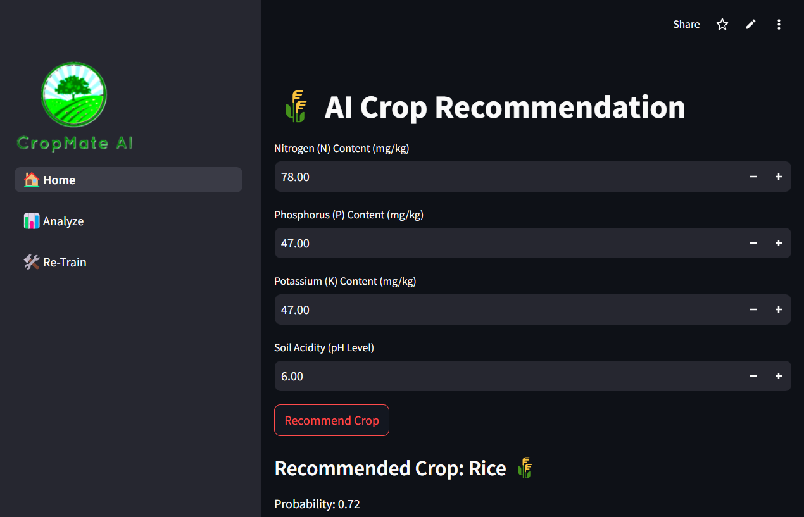
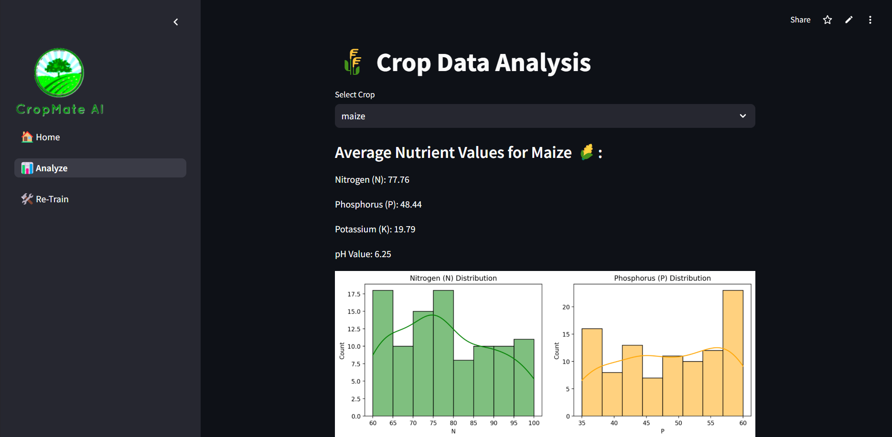
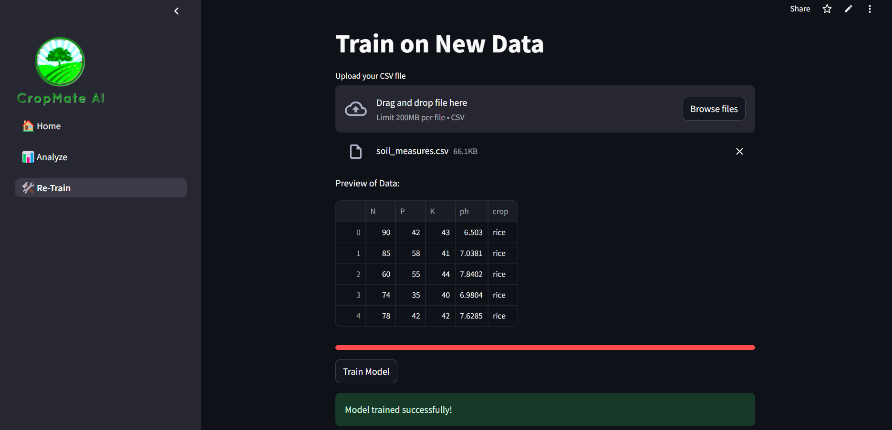

# CropMateAI

Streamlit AI crop recommendation system.

## Features
- **Crop Recommendation**: Recommends the best crop to plant based on soil conditions and other data-driven insights.
- **Analysis Page**: Analyzes and displays the average nutrition values for each crop.
- **Retrain Option**: Allows retraining the model with new data.

## Installation
```bash
pip install -r requirements.txt
```

## Usage
1. Run the Streamlit app:
    ```bash
    streamlit run app.py
    ```
2. Navigate to the Crop Recommendation page to get crop suggestions.
    
3. Use the Analysis Page to check the average nutrition values for each crop.
    
4. Use the Retrain option to update the model with new data.
    

## Requirements
- Python 3.x
- Streamlit
- Scikit-learn
- Pandas
- NumPy

## Contributing
Feel free to fork this repository and contribute by submitting a pull request.
